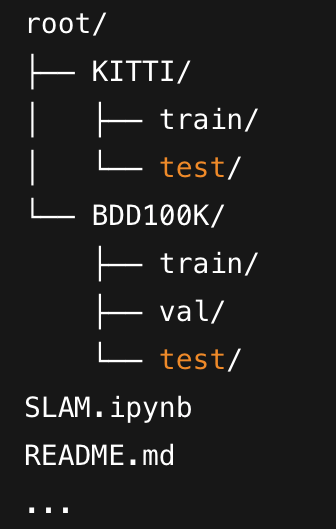

## Object-Based Visual SLAM for Urban Tram Navigation

This repository contains the code, analysis, and supporting materials for the project:

**Towards Object-Based Visual SLAM: A Revolution for Urban Tram Navigation**

The goal is to investigate how Big Data and deep learning-based object detection (YOLO) can enhance localisation accuracy in dynamic urban environments. This project includes exploratory data analysis (EDA) and visualisation of two principal datasets: KITTI Object Dectection and BDD100K.

The analytical findings are summarised in the accompanying report (`Object_Based_VSLAM_Data_Analysis.pdf`).


All analysis code is provided in:
- `SLAM.ipynb` — Main Jupyter Notebook containing:
  - Data loading
  - Visualisation (bar charts, heatmaps, co-occurrence matrices)
  - Bounding box statistics
  - Example image annotation overlays

## Setup Instructions

1. **Clone this repository**
   ```bash
   git clone https://github.com/your-username/Object-based-Visual-SLAM.git
   cd Object-based-Visual-SLAM
2. **Download and setup datasets**

- [KITTI Object Detection](https://datasetninja.com/kitti-object-detection)
- [BDD100K](https://datasetninja.com/bdd100k)

Download and extract the datasets into the main project directory (here referred to as the `\root` directory):




3. **Install dependencies**

   ```bash
   pip install pandas numpy matplotlib opencv-python tabulate
   ```

   


